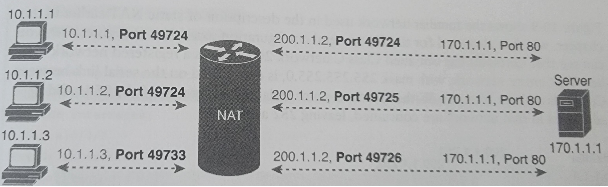
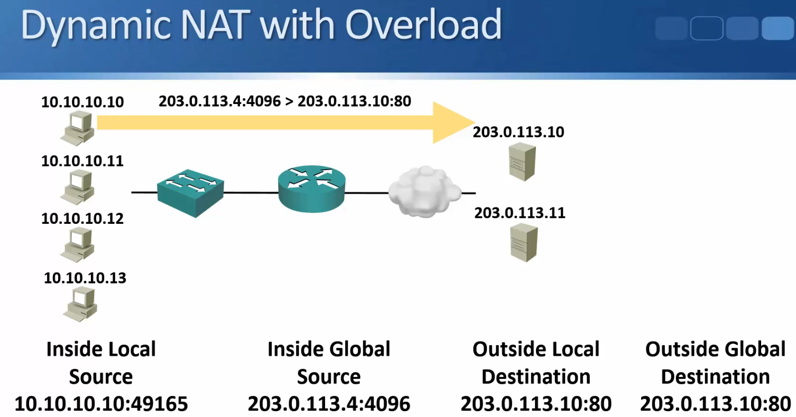

# NAT Network Address Translation #

If you don't understand how NAT works, here is a brief explanation on how it works. :)

NAT allows a host that does not have a valid, registered, globally unique IP address to communicate with other hosts through the Internet. A host that has an IP address from the private address space, see table below.

RFC 1918 specifies private IP address ranges which are not routable on the public internet. Private addresses were originally designed for hosts which should have no internet connectivity.

| Range of IP Addresses          | Network(s)                  | Class of Networks | Number of Networks |
|--------------------------------|-----------------------------|-------------------|--------------------|
| 10.0.0.0 to 10.255.255.255     | 10.0.0.0                    | A                 | 1                  |
| 172.16.0.0 to 172.31.255.255   | 172.16.0.0 - 172.31.0.0     | B                 | 16                 |
| 192.168.0.0 to 192.168.255.255 | 192.168.0.0 - 192.168.255.0 | C                 | 256                |

NAT makes this possible by using a registered IP address to represent the private address on the Internet. 10.1.1.1 is the internal non internet routable class A ip address. The router NATs the packet by changing the source IP address and when the packet returns, it changes the destination IP address.

Before we discuss different versions of NAT, it is important to understand the lingo Cisco uses to describe the process.

- Inside Global: The NAT'd address of the inside host as it will be reached by the outside network.
- Inside Local: The IP address actually configured on the inside host's Operating system.
- Outside Global: The IP address assigned to the host on the outside network by the host's owner.
- Outside Local: The IP address of the outside host as it appears to the inside network. This term is not used in source NAT which is what we need to know for the CCNA.

That may seem a bit convoluted so here is a simpler way of explaining it. I got this explanation for watching the CBT Nuggets videos. :)

- Inside - (Who owns that address, YOU).
- Outside - Who owns that address, SOMEONE ELSE).
- Local - Private
- Global - Public

## Three Versions of NAT ##

1. Dynamic NAT (Overload)

Dynamic NAT - uses a pool of public addresses which are given out on an as needed first come first served basis. Usually used for internal hosts which need to connect to the Internet **but do not accept incoming connections** that's not initiated by them. They do accept return traffic that is initiated by them.

With the standard Dynamic NAT you need a public IP address for every inside host which needs to communicate with the outside.

If you have 30 hosts, you need 30 public IP addresses. When all the addresses in the pool have been used, new outbound connections from other inside hosts will fail becauce there will no addresses left to translate them to. These hosts would have to wait for existing connections to be torn down and the translations to be released back into the pool when they time out.

### Commands to configure Dynamic NAT ###

Dynamic NAT is similar to Static NAT, we need to define an inside and an outside interface. We also need to define an access control list since Dynamic NAT needs to know which inside local IP addresses need to have their addresses translated, and it defines a pool of registered public  IP addresses to allocate.

1. Same as step one with Static NAT. Find the inside interface and in interface configuration mode do this.

ip nat inside

2. Find the outside interface, just like with Static NAT.

ip nat outside

3. Configure an ACL that matches the inside traffic for which NAT should be performed.

access-list 1 permit 10.0.6.0 0.0.0.15

4. Use the ip nat pool name *first-address last-address* netmask *subnet-mask* command in global configuration mode to configure the pool of public registered IP addresses.

ip nat pool My-Pool-Name 203.0.113.4 203.0.113.14 netmask 255.255.255.240

5. To enable Dynamic NAT we need to define the pool-name that we will use and also link it to our access control list that we just created.

ip nat inside source list 1 pool My-Pool-Name

2. **Static NAT**

Static NAT is a permanent one-to-one mapping usually between a public and private IP address. Used for servers which must accept incoming connections. Let's imagine you have the private IP address 10.0.7.15 and it's statically NATTED, it would alway get the same outside global address 213.0.113.3 as an example.

### Commands to configure Static NAT ###

Each static mapping between a inside local (private) address and a inside global (public) address must be configured. Also, because NAT maybe be used on a subset of interfaces, the router must be told on which interfaces it should use NAT and we need to tell those same interfaces whether the interface is inside or outside.

1. Step one, select the inside interface and go into configuration mode for that interface and execute the following.

ip nat inside

2. After that's done, let's jump into interface configuration for the outside interface and do the following.

ip nat outside

3. Use the following global command in global configuration mode to configure static mappings.

ip nat inside source static *inside-local inside-global*.

Here is an example:

ip nat inside source static 10.0.1.10 203.0.113.3

3. **PAT Port Address Translation (NAT Overload)**

This is the most popular options out of the three because Static and Dynamic NAT isn't optimal, especially if you want all hosts to be able to reach the Internet without the administrative headache of Static Nat or worrying about running out of expensive public IP addresses while using Dynamic NAT. This is where NAT Overloading comes in.

NAT Overload, also known as PAT, which stands for Port Address Translation, it works by combining the IP address with a port number, and that is known as a SOCKET. E.g., 213.0.11.100:50012

NAT Overload doesn't only NAT the IP address, it also NATs port numbers. Let's say you have three tabs open to your favorite website. The request is sent out from the inside local address 10.1.1.1 using port 49724, it's Natted to the public IP address 200.1.1.2 using the same port. Now we have a SOCKET, 200.1.1.2:49724.

The target IP is 170.1.1.1 on port 80, SOCKET 170.1.1.1:80. When the requested packets return from the Webserver to 200.1.1.2:49724 the NAT router check its NAT table entry for every unique combination of inside local IP address and port, it then forwards it to the right inside local host.

Because the the port number field has 16 bits, NAT overload can use more than 65,000 port numbers, allowing it to scale well without needing many registered IP addresses and in many cases, needing only on inside global IP address.

### Commands to configure PAT (NAT Overload) ###

The configuration is the same as with Dynamic NAT except we add the keyword **overload** to the end of the ip nat source list global command.

1. Same as step one with Dynamic NAT. Find the inside interface and in interface configuration mode do this.

ip nat inside

2. Find the outside interface, just like with Dynamic NAT.

ip nat outside

3. Configure an ACL that matches the inside traffic for which NAT should be performed, just like with Dynamic NAT.

access-list 1 permit 10.0.6.0 0.0.0.15

4. Configure the ip nat inside source list *acl-number* interface *type/number* **overload** in global configuration mode. Referring to the ACL created in step 3, and to the interface whose IP address will be used for translations.

ip nat inside source list 1 interface Serial0/1/0 overload

5. If you want to map it to a pool of inside global addresses you can do the following.

ip nat inside source list 1 pool My-Pool-Name overload

## General commands to check NAT ##

show ip nat translations

show ip nat statistics

debug ip nat

Debug IP NAT causes the router to issue a message every time a packet has its address translated for NAT.

clear ip nat translation *

Can be used to remove translations from the translation table. This can be useful when troubleshooting. It is also often required if you want to edit your NAT configuration - the router will not allow changes when there are active translations. The * removes all entries, if you want a more nuanced approach, check out your options and do clear ip nat translation ?