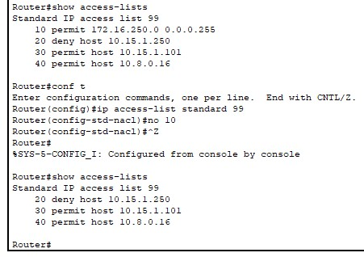

# ACLs For Packet Filtering #

## General Info ##

### Types of ACLs ###

- Standard numbered ACLs (1-99).
- Extended numbered ACLs (100-199).
- Additional ACL numbers (1300-1999 standard, 2000-2699 extended).
- Named ACLs.
- Improved editing with sequence numbers.
- ACLs are either named or numbered and they are also standard or extended. Extended ACLs have much more robust abilities in matching packets.

- An ACL identifies traffic based on characteristics of the packet such as source IP address, destination IP address, port number. Standard numbered and standard named ACLs can only match based on source IP.
- ACLs are supported on both routers and switches.
- ACLs applied to an interface do not apply to traffic which originates from the router itself.
- An ACL is read from top to bottom.
  - **As soon as a rule matches the packet, the permit or deny action is applied and the ACL is not processed any further.**
  - The order of rules is important.
- The original use of ACLs was a security feature to decide if traffic should be allowed to pass through the router. By default a router will allow all traffic to pass between its interfaces. When ACLs are applied the router identifies the traffic and then decides if it will be allowed or not.
- ACLs are also used in other software policies when traffic has to be identified, for example.
  - Identify traffic to give better service in a (QoS) Quality of Service Policy.
  - Identify traffic to translate to a different IP address in a (NAT) Network Address Translation Policy.
- Access Control Lists are made up of Access Control Entries which are a series of permit or deny rules. Each ACE is written in a seperate line. Here is an example and notice the number, it's 100, which means it's an extended list which gives us more options.
  - ```access-list 100 deny tcp 10.10.30.0 0.0.0.255 gt 49151 10.10.20.1 0.0.0.0 eq 23```
  - The source number is gt (greater than) 49151. 10.10.30.0 is the source. 10.10.20.1 is the destination.  23 is the port.
- Remember, if this was our list, that without a ANY PERMIT as the last command we would block all traffic from coming through.

## Access Groups ##

- ACLs are applied at the interface level with the Access-Group command.
- ACLs can be applied in the inbound or outbound direction.
- You can have a maximum of one ACL per interface per direction.
- You can have both an inbound and an outbound ACL on the same interface, but not 2 inbound, or 2 outbound ACLs.
- An interface can have no ACL applied, an inbound ACL only, an outbound ACL only, or ACLs in both directions.
- Done on the interface level. ```ip access-group 100 out``` or ```ip access-group 101 in```
- ```show ip interface f1/0 | include access list```

## Standard vs Extended ACLs ##

- With Standard ACLs, all we can match on is the source IP address. For anything else we have to use extended ACL. Standard ACLs are numbered from 1 through 99. 100 through 199 are extended ACLs. We can also use NAMED ACLs which are easier to manage.
- 1300 - 1999 are IP standard access list (expanded range).
- 2000 - 2699 are extended access list (expanded range).
- There is no default wildcard mask for Extended ACLs. You have to specify a wildcard mask.

## Extended ACLs ##

- First check to see if there are any access lists.
  - show access-lists
- Extended ACL access-list command requires three matching parameters: the IP protocol type, the source IP address, and the destination IP address.
- Remember that when matching a specific IP address, the extended ACL requires the use of the **host** keyword. You cannot simply list the IP address alone.
- To create an extended numbered list, enter global configuration mode.
  - access-list 100 deny icmp host 10.16.0.10 host 192.168.1.100 log
- To deny http traffic from a specific host to a specific server.
  - access-list 100 deny tcp host 10.16.0.10 host 192.168.1.100 eq 80
- The eq shouldn't always be at the end of the line. Let's say we want to deny traffic from web server 10.2.3.4/23's subnet to clients in the same subnet as host 10.4.5.6/22. We would put the eq www after the source, since we are denying traffic **from** the web server.
  - ```access-list 104 permit tcp 10.2.2.0 0.0.1.255 eq www 10.4.4.0 0.0.3.255```

### Extended ACLs and Ports ###

- With extended ACLs we have the option of working with source and destination ports. Here are the syntax keywords:
  - ```eq``` | Stands for equal.
  - ```ne``` | Stands for not equal.
  - ```lt``` | Stands for less than.
  - ```gt``` | Stands for greater than.
  - ```range``` | Stands for, you guessed it, range. :)

## Named ACLs ##

- Named ACL starts with the IP command.
- To create a named access list named Our-ACL.
  - ```ip access-list extended Our-ACL```
- After issuing that command we are now in access list configuration mode.
  - ```deny tcp host 10.16.0.10 any eq 21```
- Another example
  - ```deny ip 10.16.0.0 0.0.0.255 10.16.16.0 0.0.7.255```
- Another example
  - ```deny icmp 10.16.0.0 0.0.0.255 10.16.2.0 0.0.0.255```
- Remember to allow the rest.
  - ```permit ip any any```
- Now we need to apply this named ACL to an interface. Select the interface.
  - ```ip access-group Our-ACL | inbound | outbound```
- Verify by checking the interface. ```sh ip int``` and look at the inbound and outbound access settings.

## To Create and Verify an ACL ##

- First is to check to see if there are any access lists already. If there is a list already and we start typing away commands, we are adding to the list that’s already in place, not creating a new one.
- ```show access-lists```
- ```show ip access-lists```
- ```show run | sec access-list```

 It's also a good rule to put a remark on an ACL.

- To put a remark on an acceess list.
  - ```access-list 1 remark this access list is for X```
- It’s also good to check the access lists on the interface itself. To see outgoing access list and inbound access list.
  - ddd
- Create the list.
  - ```access list 1 deny host 10.16.0.10```
  - ```access list 1 permit any```
  - There is an implicit 'deny any any' rule at the bottom of ACLs.
  - If an ACL is not applied to an interface, all traffic is allowed.
  - **If an ACL is applied, all traffic is denied except what is explicitly allowed.**
  - Many companies put this statement at the end of the ACL so they log any deny's.
  - ```access-list 1 deny any log```
  - We know by now that the default behavior is deny any at the end of the ACL. Another way to know if things are being denied is to explicitly configure a command to deny all traffic (for example), ``` access-list 1 deny any ``` at the end of an ACL. Why would we do that when it does it by default? Because the ACL show commands list counters for the number of packets matched by each command in the ACL, but there is no counter for that impicit deny any concept at the end of the ACL. So, if you want to see counters for how many packets are matched by the deny any logic at the end of the ACL, configure an explicit deny any.

&nbsp;

- Go to the interface on the router and apply it to the correct interface.
  - ```ip access-group 1 | inbound | outbound```
- Inject an Access Control Entry into the ACL. You can do it with numbered and named ACLs.
  - ```ip access-list extended 110```
  - ```15 deny tcp host 10.10.10.11 host 10.10.50.10 eq telnet```

## Hide the fact that ICMP or other traffic is filtered ##

- You want to hide, destination host unreachable U.U.U? I think that's a good idea. :)
- Under the interface that's sending the IP unreachable messages do ```no ip unreachables```.

## To Delete ACL Entry ##

- Be careful to not do ```no access-list 99 permit 10.16.0.7```
- This would remove the whole numbered access list 99, not just that specific entry.
- The correct way would be to go into global configuration mode.
  - ```ip access-list standard 99```
  - ```no entry-number``` Let's say you wanted to delete no 10. ```no 10```

  
- Now our access list starts at 20, instead of 10. If we want to fix that and reorder the list we could do the following in global config mode. 99 is our list and the first 10 is the number we want to start from. The second 10 says we want to increment it by 10. First entry is 10, second one is 20, etc.
  - ```ip access-list resequence 99 10 10```

## Wildcard Mask With an ACL ##

- access list 2 deny host 10.16.0.0 0.0.255.255
- Remember to create permit any for access list 2.

## Final Best Practices According to Cisco Press and Wendell Odom ##

- Place extended ACLs as close as possible to the source of the packet. This strategy allows ACLs to discard the packets early.
- Place standard ACLs as close as possbile to the destination of the packet. This strategy avoids the mistake with standard ACLs (which match the source IPv4 address only) of unintentionally discarding packets that did no need to be discarded.
- Place more specific statements early in the ACL.
- Disable an ACL from its interface (using no ip access-group interface subcommand) before making changes to the ACL.

## Cisco Documentation ##

- <https://www.cisco.com/c/en/us/support/docs/security/ios-firewall/23602-confaccesslists.html>
