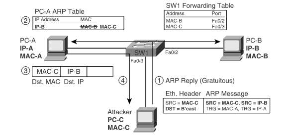

# Dynamic ARP Inspection (DAI) #

- Why is Dynamic ARP Inspection important?
  - To know if PC’s are lying about their layer 2 information. A malicious host could spoof the MAC address of another host to get frames destined for the legitimate host. If the malicious host is using good software they can forward the frames to the legitimate host after the attacker has made a copy of the frames. The traffic is going through the man-in-the-middle like we talked about in my post on DHCP Snooping, you can read it here. DAI works with the idea of trusted and untrusted ports with the same general rules as DHCP Snooping.
- How does it work?
  - DAI examines incoming ARP messages on untrusted ports to filter those it belives to be part of an attack. DAI compares incoming ARP messages with two sources, the DHCP Snooping binding table and any configured ARP ACLs (more info down below). If the incoming message does not match the data in the tables on the switch, the switch discards the ARP message.
  - Attackers don't need to wait for legitimate ARP requests to send illegitimate ARP replies, they can send one without having first received an ARP request. ARP has a built in feature where a host can inform all hosts on the subnet about its MAC address. This is allowed if let's say the host changes its MAC address. This change is sent to the broadcast address so all hosts in the subnet receive the message. This opens up a hole that attackers can use. This corrupts the ARP tables for the hosts that receive the message.
  - A picture is sometimes worth a thousand words. :) Here we have PC-C sending a gratuitous ARP Reply. That's a fancy word for something that's not justified or not necessary. A type of ARP message we just talked about, nobody asked for it. This ARP message corrupts the ARP table on PC-A by telling it that the IP address for PC-B belongs to PC-C.
  - PC-C can now either function as a man-in-the-middle attack and read/copy all the packets sent to PC-B, or terminate them on PC-C.



## ARP ACL ##

- DAI does use the DHCP Snooping table but it also relies on ARP ACLs if they are configured.
- Using ARP ACLs with DAI becomes useful for ports conncected to devices that use static IP addresses rather than DHCP.

## DAI Commands ##

- To setup DAI is really similar to how we setup DHCP Snooping in this blog post. Before we start you need to have setup DHCP Snooping unless you will rely solely on ARP ACLs which is unlikely.
- Ports connected to PCs should be untrusted, ports connected to routers and switches should be trusted.
- To see IP/MAC addresses and their associated VLANs and interfaces.
- ```sh ip dhcp snooping binding```

- Dynamic Arp Inspection (DAI) commands to see general info.
  - ```show ip arp inspection```
  - ```show ip arp inspection statistics```
  - ```show ip arp inspection vlan 30``` See per VLAN, in this case VLAN 30.
  - ```ip arp inspect trust``` A sub interface command for ports directly connected to a router or switch.

- The DAI process can use the binding table from DHCP snooping but may deny some ARP messages because they're from non-DHCP clients and the switch doesn't know the L3/L2 mappings for those clients.
  - ```show ip dhcp snooping``` To see if DHCP Snooping is enabled which DAI uses.
- To enable DAI for a specific VLAN.
  - ```ip arp inspection vlan 8```

- Everything that’s not in the DHCP Snooping table or ARP ACL list will be denied. We need to create static entries for the devices that are not found in the DHCP Snooping table by creating an ARP ACL.
  - ```arp access-list STATICIP-ACCESS-LIST``` This creates an ARP access list using the name "STATICIP-ACCESS-LIST".
  - After it's been created the cli drops us into the subinterface for the STATICIP-ACCESS-LIST. There we can define IPs and MAC addresses.
  - ```permit ip host 10.0.1.111 mac host 1234.5678.9123```

- To enable the ARP inspection list we created, done in global config.
  - ```ip arp inspection filter OUR-ACCESS-LIST vlan 30```

## Limit ARP traffic on untrusted ports ##

- Limiting DAI message rates can be important. Just like with DHCP Snooping the switch inspects the frames using the CPU, not the switch ASIC. The attacker could generate large numbers of ARP messages, driving up CPU usage in the switch. That's why it's a good idea to limit the rate of ARP messages on a port over time.
- It's important to note that DHCP Snooping does not use rate limits by default but DAI does for all interfaces. The default is 15 messages over a one second burst. DAI allows you to define bursts, DHCP Snooping does not define a burst setting. If we want to change it to 8 messages for each burst of 4 second.
- ```ip arp inspection limit rate 8 burst interval 4```
- To see the DAI configuration on interfaces.
- ```show arp inspection interfaces```
- For instance if somebody does nmap -sn for a network, that floods out ARP requests and that port will be shutdown or something else according to the err-disable policy that's been set.

### Optional DAI Message Checks ####

- There are more options available for DAI. Enabling them requires more CPU power so just be aware of that.
- There are three additional checks you can configure, you can enable one of them, two of them, or all three, it doesn't matter. To see these options execute the following command in global config mode but first we should check if any of them are set first.
- ```show ip arp inspection``` This shows us if source mac validation, destination mac validation, and ip address validation are enabled, they are disabled by default.
- To enable of any of those 3, go into global config mode
    ```ip arp inspection validate ?```  To see the 3 options.
  - You have three options, dst-mac, ip, and src-mac. select one or all of them to enable these additional ARP validation checks.
